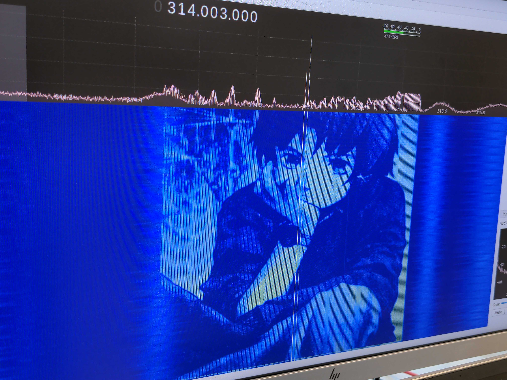

# SDR Waterfall Painting




[](https://www.python.org/)

This Python script converts a PNG image into an IQ file suitable for transmission over software-defined radio (SDR). When the generated IQ file is viewed on a waterfall plot, the transmitted image becomes visible.

## Installation

1. Clone the repository:
    ```bash
    git clone https://github.com/ui-1/sdr-waterfall.git
    ```

2. Navigate to the project directory:
    ```bash
    cd sdr-waterfall
    ```

3. Install the dependencies listed in `requirements.txt`:
    ```bash
    pip install -r requirements.txt
    ```

## Usage

Once the dependencies are installed, run `img2iq.py` as follows:

```bash
python img2iq.py image_in linetime samplerate iq_out
```

Use `-h` or `--help` to view detailed help:
```bash
usage: img2iq.py [-h] image_in linetime samplerate iq_out

Convert PNG images into IQ files, enabling visualization on a waterfall plot when broadcast over software-defined radio

positional arguments:
  image_in    Name of the input file, such as example.png
  linetime    How many seconds to repeat each line for, such as 0.01
  samplerate  Sampling rate, such as 48000
  iq_out      Name of the output IQ file, such as out.iq

optional arguments:
  -h, --help  show this help message and exit
```

## Legal Disclaimer

Ensure that you are transmitting on a legal frequency. Unauthorized transmission on certain frequencies can interfere with licensed communications and may be subject to legal consequences. Always comply with local regulations and obtain appropriate licenses if necessary.

## License

This project is licensed under the GNU General Public License v3.0 - see the [LICENSE](LICENSE) file for details.
